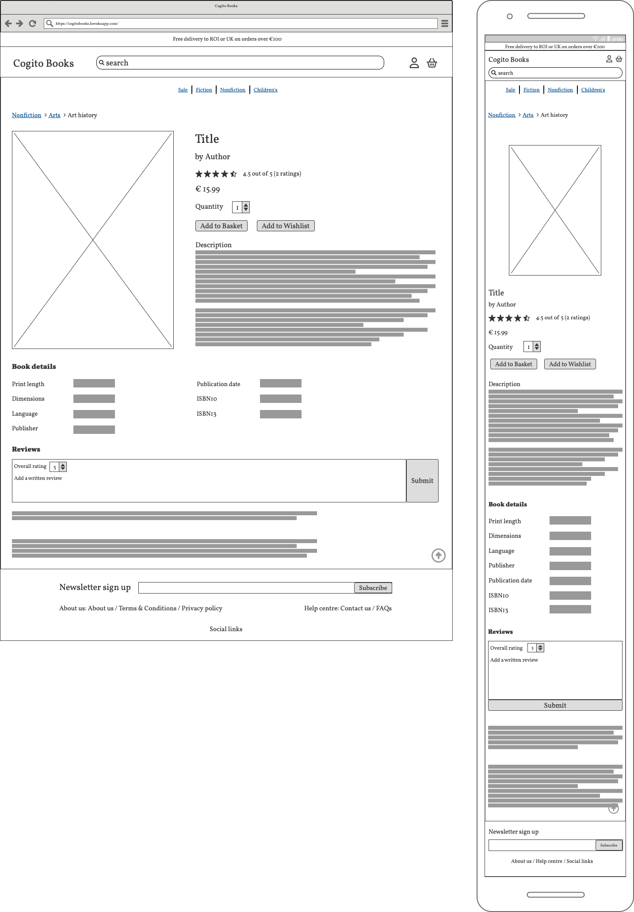
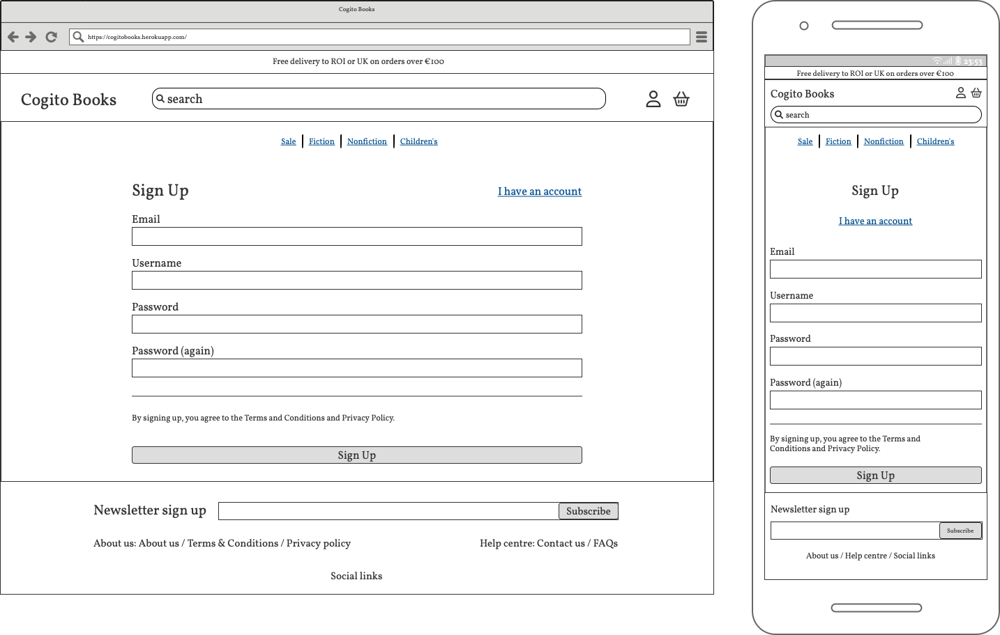
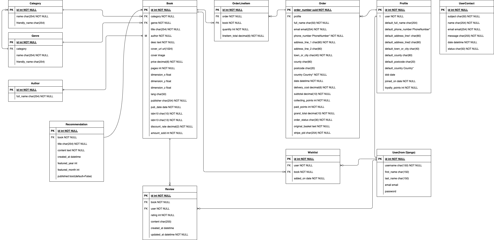

# Cogito Books

_Cogito Books_ is a fictional B2C online bookstore. The site will be targeted towards people who are interested in reading and buying books. It provides an easy-to-use interface where a user can easily find a book by searching, and make a purchase with or without registration.

The main goal of this project is to demonstrate my full-stack knowledge(HTML, CSS, JavaScript, Python/Django, relational database and Stripe payments) in a real-world context.


### View the live project [here](https://cogitobooks.herokuapp.com/)

__Note__: The site is for educational purposes only. To simulate a payment, please use a _Stripe_ test card number 4242 4242 4242 4242 with any three-digit CVC and a valid future date.

<br>

# Table of Contents

[User Experience (UX)](#user-experience-ux)
- [Website Goals](#website-goals)
- [User Stories](#user-stories)
- [Design](#design)
- [Wireframes](#wireframes)

[Technical Design](#technical-design)
- [Database](#database)
- [Entity Relationship Diagram](#entity-relationship-diagram)
- [Models](#models)

[Agile methodology](#agile-methodology)
- [MoSCoW method and story points](#moscow-method-and-story-points)
- [Iterations](#iterations)

[Search Engine Optimisation (SEO)](#search-engine-optimisation-seo)
- [Keywords](#keywords)
- [Sitemap](#sitemap)
- [Robots.txt](#robotstxt)
- [Http error pages](#http-error-pages)

[Web Marketing](#web-marketing)
- [Facebook business page](#facebook-business-page)
- [Newsletter Signup Form](#newsletter-signup-form)

[Technologies Used](#technologies-used)
- [Languages](#languages)
- [Framework](#framework)
- [Programs](#programs)

[Testing](#testing)

[Deployment](#deployment)
- [Heroku](#heroku)
- [Making a Local Clone](#making-a-local-clone)
- [Forking this Repository](#forking-this-repository)

<br>

# User Experience (UX)

## Website Goals
- To create an online bookstore that inspires users to read books. 
- To allow users to easily find a book and make a purchase.

## User Stories

- Epic: Viewing and Navigation

    | ID | Story |
    | --- | --- |
    | [#1](https://github.com/sejungkwak/cogito-books/issues/1) | As a first-time visitor, I want to know what the shop sells immediately so that I can decide whether I will browse further. |
    | [#2](https://github.com/sejungkwak/cogito-books/issues/2) | As a first-time visitor, I want to navigate pages easily so that I can find information I’m looking for. |
    | [#3](https://github.com/sejungkwak/cogito-books/issues/3) | As a shopper, I want to know if the shop is trustworthy so that I can make a purchase without any worry. |
    | [#46](https://github.com/sejungkwak/cogito-books/issues/46) | As a shopper, I want to view a list of all books so that I can easily select some to purchase. |
    | [#47](https://github.com/sejungkwak/cogito-books/issues/47) | As a shopper, I want to quickly identify deals, bestsellers and new releases so that I can easily find interesting books. |
    | [#48](https://github.com/sejungkwak/cogito-books/issues/48) | As a shopper, I want to view individual book details so that I can decide whether I want to buy the book. |

- Epic: Registration and User Accounts

    | ID | Story |
    | --- | --- |
    | [#4](https://github.com/sejungkwak/cogito-books/issues/4) | As a site user, I want to sign up so that I can save and view my details. |
    | [#5](https://github.com/sejungkwak/cogito-books/issues/5) | As a site user, I want to sign in and sign out of my account with my credentials so that I can keep my account secure. |
    | [#6](https://github.com/sejungkwak/cogito-books/issues/6) | As a site user, I want to update my password so that I can keep my account secure. |
    | [#7](https://github.com/sejungkwak/cogito-books/issues/7) | As a site user, I want to reset my password so that I can access my account even if I forget my password. |
    | [#8](https://github.com/sejungkwak/cogito-books/issues/8) | As a site user, I want to save my delivery information so that I don’t have to fill in the form every time I make a purchase. |
    | [#9](https://github.com/sejungkwak/cogito-books/issues/9) | As a site user, I want to update my delivery information so that I can keep my details up to date. |
    | [#10](https://github.com/sejungkwak/cogito-books/issues/10) | As a site user, I want to have a personalised user profile so that I can view my loyalty points and order history. |
    | [#11](https://github.com/sejungkwak/cogito-books/issues/11) | As a site user, I want to add books to my wishlist so that I can purchase them at a later time. |
    | [#12](https://github.com/sejungkwak/cogito-books/issues/12) | As a site user, I want to sign up for a newsletter so that I can receive regular updates about new books and offers. |

- Epic: Sorting and Searching

    | ID | Story |
    | --- | --- |
    | [#13](https://github.com/sejungkwak/cogito-books/issues/13) | As a shopper, I want to sort all the available books by publishing date so that I can easily identify newly released books. |
    | [#14](https://github.com/sejungkwak/cogito-books/issues/14) | As a shopper, I want to sort sci-fi books by user ratings so that I can easily identify the best rated books in sci-fi. |
    | [#15](https://github.com/sejungkwak/cogito-books/issues/15) | As a shopper, I want to search for a book by title so that I can easily find a book I’d like to purchase. |

- Epic: Book Reviews

    | ID | Story |
    | --- | --- |
    | [#16](https://github.com/sejungkwak/cogito-books/issues/16) | As a shopper, I want to view reviews of a book so that I can check what other people think of it. |
    | [#17](https://github.com/sejungkwak/cogito-books/issues/17) | As a shopper, I want to add a review so that I can share my thoughts. |
    | [#18](https://github.com/sejungkwak/cogito-books/issues/18) | As a shopper, I want to leave a rating without writing a review so that I can leave my opinion anonymously. | 
    | [#19](https://github.com/sejungkwak/cogito-books/issues/19) | As a shopper, I want to update my review so that I can change any incorrect information. |
    | [#20](https://github.com/sejungkwak/cogito-books/issues/20) | As a shopper, I want to remove my review so that I can delete an invalid or irrelevant review. |

- Epic: Purchasing and Checkout

    | ID | Story |
    | --- | --- |
    | [#21](https://github.com/sejungkwak/cogito-books/issues/21) | As a shopper, I want to add books to my basket while viewing multiple books at a time so that I can make my purchase as quickly and easily as possible. |
    | [#22](https://github.com/sejungkwak/cogito-books/issues/22) | As a shopper, I want to view items in my basket to be purchased so that I can identify the total cost of my purchase and all items I will receive. |
    | [#23](https://github.com/sejungkwak/cogito-books/issues/23) | As a shopper, I want to remove or adjust the quantity of individual items in my basket so that I can easily make changes to my purchase before checkout. |
    | [#24](https://github.com/sejungkwak/cogito-books/issues/24) | As a shopper, I want to easily enter my payment information so that I can check out quickly and with little hassle. |
    | [#25](https://github.com/sejungkwak/cogito-books/issues/25) | As a shopper, I want to collect loyalty points so that I can use it to purchase books. |
    | [#26](https://github.com/sejungkwak/cogito-books/issues/26) | As a shopper, I want to feel my personal and payment information are safe and secure so that I can confidently provide the needed information to make a purchase. |
    | [#27](https://github.com/sejungkwak/cogito-books/issues/27) | As a shopper, I want to view an order confirmation after checkout so that I can verify that I haven't made any mistakes. |
    | [#28](https://github.com/sejungkwak/cogito-books/issues/28) | As a shopper, I want to receive an email confirmation after checking out so that I can keep it as an invoice of what I've purchased for my records. |

- Epic: Help Centre

    | ID | Story |
    | --- | --- |
    | [#29](https://github.com/sejungkwak/cogito-books/issues/29) | As a shopper, I want to see FAQs so that I don’t have to contact the store and wait for them to respond. |
    | [#30](https://github.com/sejungkwak/cogito-books/issues/30) | As a shopper, I want to contact the store so that I can receive answers to my queries before purchase. |
    | [#31](https://github.com/sejungkwak/cogito-books/issues/31) | As a shopper, I want to receive notification via email the store answers my queries so that I can conveniently check it. |
    | [#32](https://github.com/sejungkwak/cogito-books/issues/32) | As a store owner, I want to receive notifications upon a shopper’s contact so that I can reply in a timely manner. |

- Epic: Admin and Store Management

    | ID | Story |
    | --- | --- |
    | [#33](https://github.com/sejungkwak/cogito-books/issues/33) | As a store owner, I want to add new products to my store so that I can ensure there is always something of interest to new and existing shoppers. |
    | [#34](https://github.com/sejungkwak/cogito-books/issues/34) | As a store owner, I want to update product details such as prices, description, images and so on so that I can keep the product details up to date. |
    | [#35](https://github.com/sejungkwak/cogito-books/issues/35) | As a store owner, I want to delete a product so that I can remove items that are no longer for sale. |

## Design

- Colour Scheme

    The main colours are black and white to enhance readability. Blue is added to particular elements such as buttons and notifications where information needs to grab the user’s attention.

- Typography

    [Montserrat](https://fonts.google.com/specimen/Montserrat) is the main font used throughout the whole website with Sans Serif as the fallback font in case the font isn't imported into the browser correctly. Montserrat has a highly readable body typeface and a variety of weights and styles.

- Logo

    

- Favicon

    

## Wireframes

<details>
    <summary>Homepage</summary>
    
</details>

<details>
    <summary>Book Category and Details</summary>
    
    
</details>

<details>
    <summary>Basket, Checkout and Order Confirmation</summary>
    
    
    
</details>

<details>
    <summary>Sign up and Sign in</summary>
    
    
</details>

<details>
    <summary>User Accounts</summary>
    
    
    
    
    
</details>

<details>
    <summary>Help Centre: Contact Us and FAQs</summary>
    
    
</details>

<br>

[Back To **Table of Contents**](#table-of-contents)

<br>

# Technical Design

## Database

[_ElephantSQL_](https://www.elephantsql.com/) was used for the main database.

## Entity Relationship Diagram



## Models

- Books app

    - Category
    - Genre
    - Author
    - Book
    - Review
    - Recommendation

- Checkout app

    - Order
    - OrderLineItem

- Helpcentre app

    - UserContact

- Profile app

    - Profile: inherits the Django user model
    - Wishlist

<br>

[Back To **Table of Contents**](#table-of-contents)

# Agile methodology

## MoSCoW method and story points

_GitHub_ Projects kanban board, Issues and Milestones were used to practise agile methodology. After creating the user stories, I prioritised each story using MoSCoW method and set the points using modified Fibonacci sequence(1, 2, 3, 5, 13) based on complexity, amount of work and repetition.

## Iterations

The project was carried out over 5 iterations between the 12th of January and the 28th of January and each iteration lasted 3 days due to the tight schedule. The velocity is 31.6.

The details can be found below:

- [Kanban board and Iteration view](https://github.com/users/sejungkwak/projects/4/views/1)
- [Milestones](https://github.com/sejungkwak/cogito-books/milestones?state=closed)

[Back To **Table of Contents**](#table-of-contents)

<br>

# Search Engine Optimisation (SEO)

## Keywords

As a part of SEO, keywords were chosen using the following steps: Firstly, write down the site’s general topics. Next, brainstorm possible keywords for each topic. Then, enter each keyword in Google search to find a list of short-tail keywords and long-tail phrases. After that, select the best ones based on their relevance, authority and volume using [Wordtracker](https://www.wordtracker.com/).
The Final list of keywords/phrases used for the site is shown in the table below in bold.


## Sitemap
`sitemap.xml` was added to the project's root folder to allow search engines to crawl and navigate.

## Robots.txt
`robots.txt` was added to the project's root folder to let search engines know which pages are accessible to web spiders.

## Http error pages

Custom error pages have been created with 4 internal links(Homepage, Books page, Account page, Contact Us page) to be more helpful to a user and provide guidance.

- 404 Page not found (
[View 404 Page](https://cogitobooks.herokuapp.com/boo))

    

- 403 Permission denied

    <details>
        <summary>Screenshot of 403 page</summary>
        
    </details>

- 400 Bad request

    <details>
        <summary>Screenshot of 400 page</summary>
        
    </details>

- 500 Sever Error

    <details>
        <summary>Screenshot of 500 page</summary>
        
    </details>

[Back To **Table of Contents**](#table-of-contents)

<br>

# Web Marketing

Social media and email marketing have been utilised for the project.

## Facebook business page

For the social media marketing, A _Facebook_ page was created and added business information. The page can be found [here](https://www.facebook.com/people/Cogito-Books/100089165571037/).

<details>
    <summary>Screenshot of the Facebook business page</summary>
    
</details>

<br>

## Newsletter Signup Form

For the email marketing, a subscription section was added in the footer using the `mailchimp-marketing` package.

<details>
    <summary>Screenshot of the subscription section</summary>
    
</details>

<br>

[Back To **Table of Contents**](#table-of-contents)

<br>

# Technologies Used

## Languages

- [Python](https://www.python.org/) was used as the main scripting language.
    - The list of third-party packages can be found [here: requirements.txt](requirements.txt).
- [HTML](https://en.wikipedia.org/wiki/HTML) was used to present and structure content.
- [CSS](https://en.wikipedia.org/wiki/CSS) was used to style content.
- [JavaScript](https://en.wikipedia.org/wiki/JavaScript) ( [jQuery](https://jquery.com/) ) was used to manipulate DOM.

## Framework

- [Django](https://www.djangoproject.com/) was used as the main Python framework.
- [Bootstrap](https://getbootstrap.com/) was heavily used for styling.

## Programs

- [AWS](https://aws.amazon.com/) was used to store static and media files.
- [Balsamiq](https://balsamiq.com/) was used to create the wireframes.
- [Canva](https://www.canva.com/en_gb/) was used to design the logo and favicon.
- [Chrome DevTools](https://developer.chrome.com/docs/devtools/) was used to view the site's styling, debug during development and check runtime performance.
- [Diagrams.net](https://app.diagrams.net/) was used to create the ERD.
- [_ElephantSQL_](https://www.elephantsql.com/) was used to store data.
- [Favicon.io](https://favicon.io/) was used to create the favicon.
- [Font Awesome](https://fontawesome.com/) was used for the icons' SVG code.
- [Git](https://git-scm.com/) was used for version control.
- [GitHub](https://github.com/) was used to store and deploy the project's code.
- [Gitpod](https://www.gitpod.io/) was used to develop and test my code.
- [Google Fonts](https://fonts.google.com/) was used to embed Montserrat.
- [Grammarly](https://www.grammarly.com/) was used to check for errors in the README.
- [Heroku](https://heroku.com/) was used to deploy the project.
- [NY Times Books API](https://developer.nytimes.com/docs/books-product/1/overview) was used to get a list of books.
- [Privacy Policy Generator](https://www.privacypolicygenerator.info/) was used to create the site's privacy policy.
- [Stripe](https://stripe.com/) was used to accept payments.
- [Techsini](https://techsini.com/multi-mockup/index.php) was used to create the image showing a responsive design for the README.
- [Terms and Conditions Generator](https://www.termsandconditionsgenerator.com/) was used to create the site's terms and conditions.
- [Visual Studio Code](https://code.visualstudio.com/) was used to edit my code and create SVG paths from SVG image files.
- [XML-Sitemaps.com](https://www.xml-sitemaps.com/) was used to generate the `sitemap.xml` file.

[Back To **Table of Contents**](#table-of-contents)

<br>

# Testing

Testing details can be found [here](documentation/TESTING.md)

[Back To **Table of Contents**](#table-of-contents)

<br>

# Deployment

## _Heroku_

This project was deployed from _GitHub_ to _Heroku_ using _ElephantSQL_ and _AWS_. These steps demonstrate how I set up for deployment.

1. Create a new database instance on _ElephantSQL_.
2. On the _ElephantSQL_ dashboard, select the instance I just created.
3. Copy the value of the URL field.
4. Go to _Heroku_ and create a new app.
5. Paste the database URL into the Config Var field. 
6. In the terminal, run the following command: `pip3 install dj_database_url==0.5.0 psycopg2`
7. In the terminal, run the following command: `pip freeze > requirements.txt`
8. In `settings.py`, comment out the original DATABASES section and add the new code to connect to the _ElephantSQL_ database:

    ```
    # DATABASES = {
    #     'default': {
    #         'ENGINE': 'django.db.backends.sqlite3',
    #         'NAME': os.path.join(BASE_DIR, 'db.sqlite3'),
    #     }
    # }
        
    DATABASES = {
        'default': dj_database_url.parse('my-database-url')
    }
    ```

9. In the terminal, run the following command: `python3 manage.py showmigrations`
10. Make sure that none of the migrations is checked off.
11. Migrate my database models to the new database by running the following command: `python3 manage.py migrate`
12. Load the fixtures in the following order: 

    1. `python3 manage.py loaddata categories`
    2. `python3 manage.py loaddata genres`
    3. `python3 manage.py loaddata authors`
    4. `python3 manage.py loaddata books`

13. Create a superuser for the new database: `python3 manage.py createsuperuser`
14. Revert to the original database after the migrations.
15. To confirm the migrations are successful, go to _ElephantSQL_ and select __BROWSER__ on the left hand side menu.
16. Click the `Table queries` button and then `auth_user`.
17. Click `Execute` and 1 superuser that I just created returns.
18. In `settings.py`, change the database settings as follows:

    ```
    if 'DATABASE_URL' in os.environ:
    DATABASES = {
        'default': dj_database_url.parse(os.environ.get('DATABASE_URL'))
    }
    else:
        DATABASES = {
            'default': {
                'ENGINE': 'django.db.backends.sqlite3',
                'NAME': os.path.join(BASE_DIR, 'db.sqlite3'),
            }
        }
    ```

19. In the terminal, install `gunicorn`: `pip3 install gunicorn`.
20. Add it to the dependency list: `pip3 freeze > requirements.txt`.
21. Create `Procfile`.
22. Add the line below to the file. (I input `cogito-books` at first and got an error `H10-App Crashed`. The hyphen should be an underscore.)

    ```
    web: gunicorn cogito_books.wsgi:application
    ```

23. Add `DISABLE_COLLECTSTATIC` and set it to `1` in the __Config Var__ field on _Heroku_.
24. In `settings.py`, add the _Heroku_ URL to __ALLOWED_HOSTS__.
25. Add, commit and push all the changes to _Git_.
26. Under the __Deploy__ tab on _Heroku_, connect to _GitHub_ repository.
27. Enable automatic deploys for the next time.
28. For this time, deploy manually by clicking the __Deploy Branch__ button.
29. In `settings.py`, change the __DEBUG__ variable to `'DEVELOPMENT' in os.environ`.
30. Add, commit and push it to _Git_.
31. Sign in _AWS_ and go to __AWS Management Console__.
32. Search for S3.
33. Select __Create bucket__.
34. Enter name, select region, __ACLs enabled__ > __Bucket owner preferred__ for the object ownership section and uncheck __Block all public access__.
35. Click the Create bucket button.
36. Select the bucket I just created.
37. Go to the __Static website hosting__ and select __Use this bucket to host a website__ and enter `index.html` and `error.html` in the document fields.
38. Go to __Permissions__ and add the configuration to the editor.

    ```
    [
        {
            "AllowedHeaders": [
                "Authorization"
            ],
            "AllowedMethods": [
                "GET"
            ],
            "AllowedOrigins": [
                "*"
            ],
            "ExposeHeaders": []
        }
    ]

    ```

39. Go to __Policy Generator__.
40. Select __S3 Bucket Policy__ for the type of policy.
41. Enter `*` in __Principal__, select __GetObject__ for __Actions__ and input __ARN__(Amazon Resource Name).
42. Click __Add Statement__ and then __Generate Policy__.
43. Copy the policy that popped up and paste it into the editor.
44. Add `/*` onto the end of the resource key to allow access to all resources.
45. Click __Save__.
46. For the __Access control list (ACL)__ section, click __Edit__ and enable __List__ for __Everyone (public access)__.
47. Go to __IAM__.
48. Select __User Groups__ from the left hand side menu.
49. Click the __Create group__ button.
50. Enter the group name and click the __Create group__ button.
51. Select __Policies__ from the left hand side menu.
52. Click the __Create policy__ button.
53. Select the __JSON__ tab and click __Import managed policy__.
54. In the popup window, search for S3 and select __AmazonS3FullAccess__.
55. Change the value of the __Resource__ to the following:

    ```
    [
        "my_ARN",
        "my_ARN/*",
    ]
    ```

56. Click __Review Policy__.
57. Give it a name and description and create it.
58. Go back to __User Groups__.
59. Select a group for this project. 
60. Go to the __Permissions__ tab.
61. open __Add permissions__ and click __Attach policies__.
62. Select the policy and click __Add permissions__.
63. Select __User__ from the left hand side menu.
64. Click __Add user__.
65. Enter a user name and select __Next__.
66. Check off the user and click the buttons until the last step.
67. Click __Download .csv__.
68. Add the credentials from the above steps to _Heroku_ __Config Vars__.
69. In the terminal, install the following packages. `boto3` and `django-storages`.
70. Add `django-storages` to __INSTALLED_APP__.
71. On _Heroku_, add `USE_AWS` to __Config Vars__, set it to `True` and remove `DISABLE_COLLECTSTATIC`.
72. Add a file called `custom_storages.py` to the project's root folder.
73. Add the code below:

    ```
    from django.conf import settings
    from storages.backends.s3boto3 import S3Boto3Storage


    class StaticStorage(S3Boto3Storage):
        location = settings.STATICFILES_LOCATION


    class MediaStorage(S3Boto3Storage):
        location = settings.MEDIAFILES_LOCATION
    ```

74. Add AWS configurations to `settings.py`.

    ```
    if 'USE_AWS' in os.environ:
        AWS_S3_OBJECT_PARAMETERS = {
            'Expires': 'Thu, 31 Dec 2099 20:00:00 GMT',
            'CacheControl': 'max-age=94608000',
        }

        AWS_STORAGE_BUCKET_NAME = 'cogitobooks'
        AWS_S3_REGION_NAME = 'us-east-1'
        AWS_ACCESS_KEY_ID = os.environ.get('AWS_ACCESS_KEY_ID')
        AWS_SECRET_ACCESS_KEY = os.environ.get('AWS_SECRET_ACCESS_KEY')
        AWS_S3_CUSTOM_DOMAIN = f'{AWS_STORAGE_BUCKET_NAME}.s3.amazonaws.com'

        STATICFILES_STORAGE = 'custom_storages.StaticStorage'
        STATICFILES_LOCATION = 'static'
        DEFAULT_FILE_STORAGE = 'custom_storages.MediaStorage'
        MEDIAFILES_LOCATION = 'media'

        STATIC_URL = f'https://{AWS_S3_CUSTOM_DOMAIN}/{STATICFILES_LOCATION}/'
        MEDIA_URL = f'https://{AWS_S3_CUSTOM_DOMAIN}/{MEDIAFILES_LOCATION}/'
    ```

75. Add, commit and push all the changes to `Git`.
76. Go to _AWS_ S3.
77. Click __Create folder__ and name it `media`.
78. Add all the images used in this project to the folder.
79. Select __Grant public read access to this object(s)__ and click __Next__ and __Upload__.
80. Go to the admin site and check off __PRIMARY__ and __VERIFIED__ for the admin address.
81. Go to _Stripe_ and create a new webhook endpoint for the deployed version.
82. Add __Signing secret__ to __Config Vars__ on _Heroku_.

## Making a Local Clone

These steps demonstrate how I cloned my repository to create a local copy on my computer to run the code locally.

1. Navigate to [my _GitHub_ Repository](https://github.com/sejungkwak/cogito-books).
2. Click the __Code__ button above the list of files.
3. Select __HTTPS__ under __Clone__. I have chosen this option as it is simpler than SSH.
4. Click the copy icon on the right side of the URL.
5. Open the Terminal.
6. Change the current working directory to the location where I want the cloned directory.
7. Type `git clone ` and then paste the URL I copied in step 4.
  
  ```
  $ git clone https://github.com/sejungkwak/cogito-books.git
  ```

8. Press enter. Messages are displayed in the Terminal to indicate the local clone has been successfully created.

## Forking this Repository

These steps demonstrate how to make a copy of this repository on your _GitHub_ account to make changes without affecting this repository or to deploy the site yourself.

1. Log in to your _GitHub_ account.
2. Navigate to [this repository](https://github.com/sejungkwak/cogito-books).
3. Click the __fork__ button on the top right side of the repository.
4. You should now have a copy of the original repository in your _GitHub_ account.
5. You can make a local clone from the copied repository on your computer using the steps demonstrated in [Making a Local Clone](#making-a-local-clone) and/or deploy to _Heroku_ using the steps demonstrated in [Heroku](#heroku).

Note: It is crucial to create a virtual environment to run the project on your local machine to protect other Python projects.
I have set up a virtual environment by the steps below:
1. Head over to the directory and create a virtual environment by typing `virtualenv .venv` in the terminal.
2. Type `. .venv/bin/activate` to activate the virtual environment.
3. Run `pip3 install -r requirements.txt` in the terminal to install dependencies that are listed in the `requirements.txt` file.

[Back To **Table of Contents**](#table-of-contents)

<br>